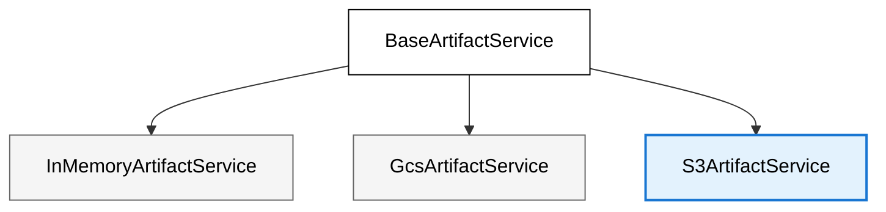

# Artifacts

This library contains additional artifact services that complement the [standard artifact services](https://google.github.io/adk-docs/artifacts) available in the ADK ecosystem.


<div align="center">



</div>

## S3ArtifactService

**Storage Mechanism:** Leverages AWS S3 or any S3-compatible storage (such as MinIO, DigitalOcean Spaces, Wasabi, Backblaze B2, and others) for persistent artifact storage. Each version of an artifact is stored as a separate object within the specified bucket.

**Object Naming Convention:** Constructs S3 object keys using a hierarchical path structure:
```
<app_name>/<user_id>/<session_id>/<filename>/<version>
```
If the filename uses a user namespace (starts with `user:`), the path becomes:
```
<app_name>/<user_id>/user/<filename>/<version>
```

### Key Features
- **Persistence:** Artifacts are stored durably in S3 or any S3-compatible backend, surviving application restarts and deployments.
- **Scalability:** Leverages the scalability, durability, and high availability of S3 and compatible providers.
- **Versioning:** Each save operation stores a new version as a distinct S3 object, enabling retrieval of specific artifact versions.
- **Compatibility:** Works with AWS S3, MinIO, DigitalOcean Spaces, Wasabi, Backblaze B2, and any provider compatible with [boto3](https://boto3.amazonaws.com/v1/documentation/api/latest/index.html). You can also pass extra keyword arguments (`**kwargs`) to `S3ArtifactService` during initialization, which are forwarded directly to `boto3.client('s3', ...)` for advanced configuration (e.g., custom timeouts, SSL options, etc.).
- **Flexible Credentials:** Credentials can be provided explicitly or loaded from your environment (e.g., AWS environment variables, IAM roles, or local AWS config).

### Permissions Required
The application environment must have permissions to read from and write to the specified S3 bucket. For AWS, this typically means the IAM user or role must have `s3:GetObject`, `s3:PutObject`, `s3:ListBucket`, and `s3:DeleteObject` permissions.

### Use Cases
- Production environments requiring persistent, scalable artifact storage.
- Scenarios where artifacts need to be shared across different application instances or services (by accessing the same S3 bucket).
- Applications needing long-term storage and retrieval of user or session data.
- Deployments on AWS, on-premises, or cloud providers supporting S3-compatible APIs.

### Instantiation

```python
from adk_extra_services.artifacts.s3_artifact_service import S3ArtifactService

bucket_name = "your-s3-bucket-name"  # Replace with your bucket name
endpoint_url = "https://s3.amazonaws.com"  # Or your S3-compatible endpoint (e.g., MinIO, AWS S3)

# Option 1: Use environment credentials (recommended for AWS setups)
s3_service = S3ArtifactService(
    bucket_name=bucket_name,
    endpoint_url=endpoint_url
)
print(f"S3ArtifactService initialized for bucket: {bucket_name}")
# Ensure your environment has credentials to access this bucket.
# e.g., via AWS environment variables, IAM roles, or config files

# Option 2: Pass explicit credentials
# s3_service = S3ArtifactService(
#     bucket_name=bucket_name,
#     endpoint_url=endpoint_url,
#     aws_access_key_id="YOUR_ACCESS_KEY",
#     aws_secret_access_key="YOUR_SECRET_KEY",
#     region_name="us-east-1"
# )

# Then pass it to the Runner
runner = Runner(..., artifact_service=s3_service)
```
---

### Example: Using MinIO

To run the example with MinIO:

1. **Start MinIO:**
   Make sure your MinIO server is running. You can use the following Docker command:
   ```bash
   docker run -p 9000:9000 -p 9001:9001 minio/minio server /data --console-address ":9001"
   ```

2. **Create the Bucket:**
   You must create the bucket you want to use (in this example, `test-bucket`) before running the script. You can do this via the MinIO web UI at [http://localhost:9001](http://localhost:9001) or with the MinIO client:
   ```bash
   mc alias set local http://localhost:9000 minioadmin minioadmin
   mc mb local/test-bucket
   ```
   *(If you don't have `mc` installed, you can download it from https://min.io/download#/mc)*

3. **Prepare your environment:**
   - `cd` into the `examples/artifacts` directory:
     ```bash
     cd examples/artifacts
     ```
   - Copy `.env.example` to `.env`:
     ```bash
     cp .env.example .env
     ```
   - Edit `.env` to add your Google API key. For MinIO, you can keep the default credentials and endpoint as shown in the example.

4. **Run the example:**
   ```bash
   python s3_artifact_example.py
   ```

If everything is configured correctly, you should see a `.csv` file created in your MinIO bucket (`test-bucket`).

---

For a complete usage example, see [`s3_artifact_example.py`](./s3_artifact_example.py).

**Note:** This example is designed for MinIO or any S3-compatible storage and does not require AWS.

After MinIO is running and your bucket is created, you can run the example:

```bash
python s3_artifact_example.py
```

### Implementation Details

For implementation details, see [`adk_extra_services/artifacts`](../../src/adk_extra_services/artifacts/  ).