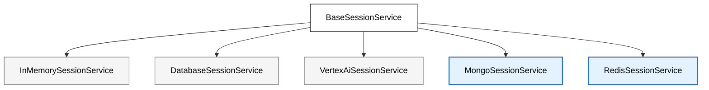

# Sessions

This library contains additional session services that complement the [standard session services](https://google.github.io/adk-docs/sessions) available in the ADK ecosystem.

<div align="center">



</div>

---

## MongoSessionService

**How it works:** Stores session state in a MongoDB collection.
**Persistence:** Yes. Sessions are durably stored in MongoDB and survive application restarts or deployments.
**Requires:** A running MongoDB instance (self-hosted, Atlas, or compatible service).
**Best for:** Applications that already use MongoDB or prefer a document-oriented database for session persistence.


### Instantiation

```python
from adk_extra_services.sessions import MongoSessionService

mongo_service = MongoSessionService(
    mongo_url="mongodb://your_mongo_uri:your_mongo_port",  # Your MongoDB URI
    db_name="adk_test" # The name of the database you want to use
)

runner = Runner(..., session_service=mongo_service)
```

*(`MongoSessionService` forwards any extra `**kwargs` you pass straight to `motor.AsyncIOMotorClient`, so you can tweak timeouts, TLS, etc.)*

### Example: Using Docker MongoDB

1. **Start MongoDB (Docker):**
   ```bash
   docker run -d --name adk-mongo -p 27017:27017 mongo:6
   ```

2. **Prepare your environment:**
   - `cd` into the `examples/sessions` directory:
     ```bash
     cd examples/sessions
     ```
   - Copy `.env.example` to `.env` (optional):
     ```bash
     cp .env.example .env
     ```
   - Add your `GOOGLE_API_KEY` in `.env` if needed.

3. **Run the example:**
   ```bash
   python mongodb_session_example.py
   ```

---

## RedisSessionService

**How it works:** Manages session state in Redis, using key–value storage with optional expiration for fast in-memory reads and writes.
**Persistence:** Optional. Configure Redis with AOF or RDB snapshots to persist data; otherwise, data is in-memory only.
**Requires:** A running Redis instance (self-hosted, Redis Cloud, or compatible service).
**Best for:** High-performance applications needing ultra-low-latency session access or distributed caches.

### Instantiation

```python
from adk_extra_services.sessions import RedisSessionService

redis_service = RedisSessionService(redis_url="redis://your_redis_uri:your_redis_port")

runner = Runner(..., session_service=redis_service)
```

*(`RedisSessionService` forwards any extra `**kwargs` to `aioredis.from_url`, giving you full control over pools, SSL, etc.)*

### Example: Using Docker Redis

1. **Start Redis (Docker):**
   ```bash
   docker run -d --name adk-redis -p 6379:6379 redis:7
   ```

2. **Prepare your environment:**
   ```bash
   cd examples/sessions
   cp .env.example .env 
   ```
   Add your `GOOGLE_API_KEY` in `.env` if needed.

3. **Run the example:**
   ```bash
   python redis_session_example.py
   ```

---

### Implementation Details

For implementation details, consult the source code in [`adk_extra_services/sessions`](../../src/adk_extra_services/sessions).